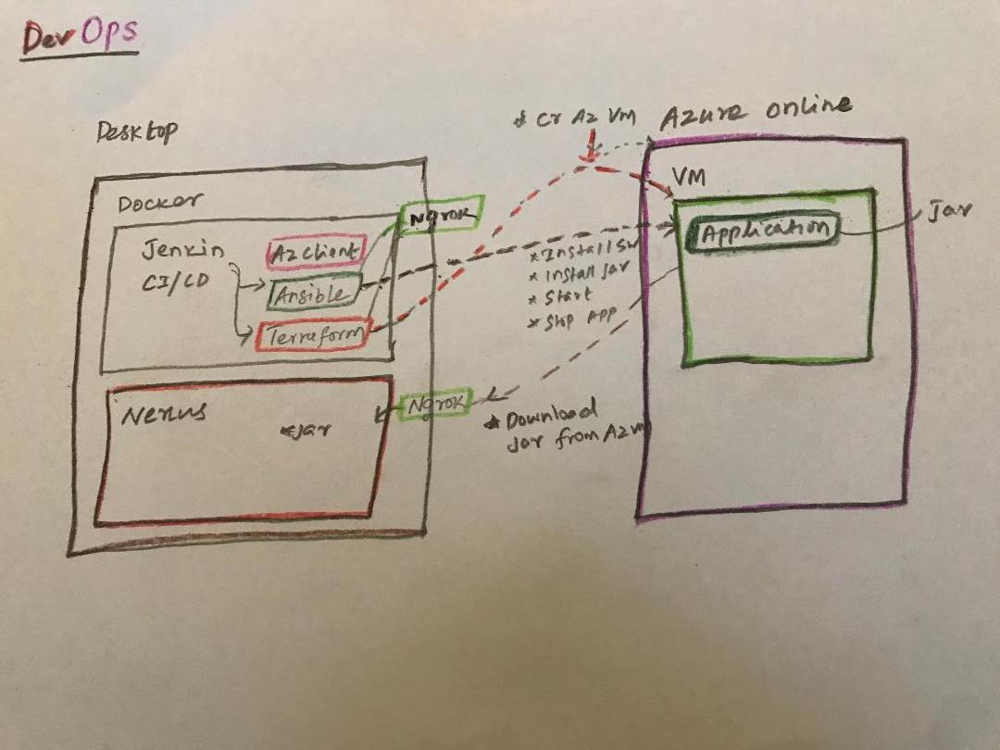

# DevOps_Jenkin_Ansible_Terraform_Azure



1. Created sample application using <b>spring-boot</b>

2. <b>Maven</b> for build and <b>Nexus</b> for dependency and packaging

3. <b>SonarQube</b> for code quality and vulnerability check

4. <b>Terraform</b> for provisioning VM on <b>Azure</b>

5. <b>Ansible</b> to install java and run application on VM 

6. <b>Jmeter</b> for load testing

7. Destroy VM from Azure

## Steps to install Jenkin and nexus

1.Install docker on you laptop/deskptop

2.install jenkin image

3.docker exec -u root -it jenkins bash

4.docker run -it -d -u root -e GIT_SSL_NO_VERIFY=1 -v mystorage:/app --name jenkins -p 9090:8080 jenkins/jenkins

5.az client installation

6.https://mohitgoyal.co/2018/06/11/install-azure-cli-2-0-on-ubuntu/

7.https://docs.ansible.com/ansible/latest/installation_guide/intro_installation.html

8.az login -u <username>-p <password>

9.docker run -d -p 7070:8081 --name nexus sonatype/nexus3

10. install ngrok to access jenkin and nexus remotely

## Steps to install private repo on Azure VM

https://medium.com/@incubusattax/setting-up-nexus-oss-in-azure-3d5f38e1f53c

## steps to connect repo from project and maven settings.xml

### Changes in pom.xml

```
<repositories>
        <repository>
            <id>spring-releases</id>
            <url>https://repo.spring.io/libs-release</url>
        </repository>
        <repository>
            <id>maven-public</id>
            <url>http://nexu.eastus.cloudapp.azure.com:8081/repository/maven-public/</url>
        </repository>
    </repositories>
    <pluginRepositories>
        <pluginRepository>
            <id>spring-releases</id>
            <url>https://repo.spring.io/libs-release</url>
        </pluginRepository>
    </pluginRepositories>
    <distributionManagement>
        <repository>
            <id>nexus-dellemc</id>
            <url>http://nexu.eastus.cloudapp.azure.com:8081/repository/nexus-dellemc/</url>
        </repository>
    </distributionManagement>
```

### Settings.xml

```
 
 <server>
      <id>nexus-dellemc</id>
      <username>admin</username>
      <password>admin123</password>
</server>


<server>
      <id>maven-public</id>
      <username>admin</username>
      <password>admin123</password>
</server>

```

Mirror

```

   <mirror>
      <id>central</id>
      <name>central</name>
      <url>http://nexus.eastus.cloudapp.azure.com:8081/repository/maven-public/</url>
      <mirrorOf>*</mirrorOf>
    </mirror>
    
```

 ## Install Sonar Qube
    
    
 ## CI/CD Pipeline Jenkinfile
 
```

   pipeline {
    agent any

    tools {
        maven 'Maven-3.6.0'
        jdk 'jdk1.8.0'
    }

    stages {

        stage('Build') {
            steps {
                checkout scm
                withEnv(["PATH+MAVEN=${tool 'Maven-3.6.0'}/bin"]) {
                    sh "/Applications/cia/apache-maven-3.6.0/bin/mvn -X clean compile"
                }
            }
        }

        stage('Test') {
            steps {
                echo("Perform Unit Test")
                withEnv(["PATH+MAVEN=${tool 'Maven-3.6.0'}/bin"]) {
                    sh "/Applications/cia/apache-maven-3.6.0/bin/mvn -X clean test"
                }

                junit('**/target/surefire-reports/TEST-*.xml')


                echo("Perform Integration Test")

                echo("SonarQube Integration")
                sh '/Applications/cia/apache-maven-3.6.0/bin/mvn clean package sonar:sonar'

                echo("IBM AppScan for CVE Check")
            }
        }


        stage('Package') {
            steps {
                withEnv(["PATH+MAVEN=${tool 'Maven-3.6.0'}/bin"]) {
                    sh "/Applications/cia/apache-maven-3.6.0/bin/mvn -X clean deploy"
                }

            }
        }

        stage('Provision') {
            steps {
                echo("Provisioning VM on Azure")
                dir("/Users/Shared/Jenkins/Home/workspace/ansible_master/terraform") {
                    sh '''
                            export PATH=$PATH:/usr/local/bin
                            touch output
                            terraform init
                            az login -u <AZUREUSERID> -p <Azure Password>
                            terraform plan -out=output
                            terraform apply -auto-approve
                            terraform output -json public_ip_address | jq '.value' > /Users/Shared/Jenkins/Home/workspace/ansible_master/ansible/environments/test/hosts
                     '''
                }
            }
        }


        stage('Deploy') {
            steps {
                echo("Deploying Application using Ansible Playbook")
                withEnv(["PATH+ANSIBLE=${tool 'ansible'}/bin"]) {
                    sh '''
                                  export ANSIBLE=/usr/local/Cellar/ansible/2.7.5
                                  export PATH=$PATH:$ANSIBLE/bin:/usr/local/bin
                                  export ANSIBLE_HOST_KEY_CHECKING=False
                                  echo "ANSIBLE = ${ANSIBLE}"
                                  sshpass -p <VM PASSWORD> ansible-playbook /Users/Shared/Jenkins/Home/workspace/ansible_master/ansible/playbooks/deploy.yml -i /Users/Shared/Jenkins/Home/workspace/ansible_master/ansible/environments/test/hosts -s -U root -u <VMUSERNAME> -k                
                    '''
                }
            }
        }

        stage('Load Test') {
            steps {
                build job: 'JMeter - Freestyle'
            }
        }

        stage('Delete VM?') {
            steps {
                script {
                    def userInput = input(id: 'confirm', message: 'Deploy new build?', parameters: [[$class: 'BooleanParameterDefinition', defaultValue: false, description: 'Deploy', name: 'confirm']])
                }
            }
        }

        stage('Delete VM') {
            steps {
                echo("Provisioning VM on Azure")
                dir("/Users/Shared/Jenkins/Home/workspace/ansible_master/terraform") {
                    sh '''
                            export PATH=$PATH:/usr/local/bin
                            az login -u <REPLACEUSERNAME> -p <REPLACE PASSWORD>
                            terraform destroy -auto-approve
                            '''
                }
            }
        }
    }
}
```

## Teraform Script to create VM on the fly
```
resource "azurerm_resource_group" "test" {
  name = "acctestrg"
  location = "West US 2"
}

resource "azurerm_virtual_network" "test" {
  name = "acctvn"
  address_space = [
    "10.0.0.0/16"]
  location = "${azurerm_resource_group.test.location}"
  resource_group_name = "${azurerm_resource_group.test.name}"
}

resource "azurerm_subnet" "test" {
  name = "acctsub"
  resource_group_name = "${azurerm_resource_group.test.name}"
  virtual_network_name = "${azurerm_virtual_network.test.name}"
  address_prefix = "10.0.2.0/24"
}

resource "azurerm_public_ip" "test" {
  name = "publicIPForLB"
  location = "${azurerm_resource_group.test.location}"
  resource_group_name = "${azurerm_resource_group.test.name}"
  allocation_method       = "Static"
  idle_timeout_in_minutes = 30
  domain_name_label="dellemcappdemo"
  tags {
    environment = "staging"
  }
}

resource "azurerm_network_security_group" "test" {
  name                = "acceptanceTestSecurityGroup1"
  location            = "${azurerm_resource_group.test.location}"
  resource_group_name = "${azurerm_resource_group.test.name}"
  tags {
    environment = "staging"
  }
}

resource "azurerm_network_security_rule" "test1" {
  name                        = "SSH"
  priority                    = 340
  direction                   = "Inbound"
  access                      = "Allow"
  protocol                    = "*"
  source_port_range           = "*"
  destination_port_range      = "22"
  source_address_prefix       = "*"
  destination_address_prefix  = "*"
  resource_group_name         = "${azurerm_resource_group.test.name}"
  network_security_group_name = "${azurerm_network_security_group.test.name}"
}

resource "azurerm_network_security_rule" "test2" {
  name                        = "8080"
  priority                    = 1020
  direction                   = "Inbound"
  access                      = "Allow"
  protocol                    = "Tcp"
  source_port_range           = "*"
  destination_port_range      = "8080"
  source_address_prefix       = "*"
  destination_address_prefix  = "*"
  resource_group_name         = "${azurerm_resource_group.test.name}"
  network_security_group_name = "${azurerm_network_security_group.test.name}"
}


resource "azurerm_network_interface" "test" {
  count = 1
  name = "acctni${count.index}"
  location = "${azurerm_resource_group.test.location}"
  resource_group_name = "${azurerm_resource_group.test.name}"
  network_security_group_id = "${azurerm_network_security_group.test.id}"
  ip_configuration {
    name = "testConfiguration"
    subnet_id = "${azurerm_subnet.test.id}"
    private_ip_address_allocation = "dynamic"
    public_ip_address_id = "${azurerm_public_ip.test.id}"
  }
}

resource "azurerm_managed_disk" "test" {
  count = 1
  name = "datadisk_existing_${count.index}"
  location = "${azurerm_resource_group.test.location}"
  resource_group_name = "${azurerm_resource_group.test.name}"
  storage_account_type = "Standard_LRS"
  create_option = "Empty"
  disk_size_gb = "1023"
}

resource "azurerm_availability_set" "avset" {
  name = "avset"
  location = "${azurerm_resource_group.test.location}"
  resource_group_name = "${azurerm_resource_group.test.name}"
  platform_fault_domain_count = 2
  platform_update_domain_count = 2
  managed = true
}

resource "azurerm_virtual_machine" "test" {
  count = 1
  name = "dellemc_demo"
  location = "${azurerm_resource_group.test.location}"
  availability_set_id = "${azurerm_availability_set.avset.id}"
  resource_group_name = "${azurerm_resource_group.test.name}"
  network_interface_ids = ["${azurerm_network_interface.test.id}"]
  vm_size = "Standard_DS1_v2"


  storage_image_reference {
    publisher = "Canonical"
    offer = "UbuntuServer"
    sku = "16.04-LTS"
    version = "latest"
  }

  storage_os_disk {
    name = "myosdisk${count.index}"
    caching = "ReadWrite"x
    create_option = "FromImage"
    managed_disk_type = "Standard_LRS"
  }

  # Optional data disks
  storage_data_disk {
    name = "datadisk_new_${count.index}"
    managed_disk_type = "Standard_LRS"
    create_option = "Empty"
    lun = 0
    disk_size_gb = "1023"
  }

  storage_data_disk {
    name = "${element(azurerm_managed_disk.test.*.name, count.index)}"
    managed_disk_id = "${element(azurerm_managed_disk.test.*.id, count.index)}"
    create_option = "Attach"
    lun = 1
    disk_size_gb = "${element(azurerm_managed_disk.test.*.disk_size_gb, count.index)}"
  }

  os_profile {
    computer_name = "dellemcdemovm"
    admin_username = "testadmin"
    admin_password = "Password1234!"
  }

  os_profile_linux_config {
    disable_password_authentication = false
  }

  tags {
    environment = "staging"
  }
}


output "public_ip_address" {
  value = "${azurerm_public_ip.test.ip_address}"
}

```

## Ansible Script


```
---
- hosts: all
  vars:
      deploy_dir: "/deploy"
      application_dir: "/service/rest-service"
      application_jar_name: "rest-service-latest.jar"
      application_version: "1.0.0"
      application_group_id: "org.springframework"
      application_artifact_id: "rest-service"
      application_repository_url: "http://nexu.eastus.cloudapp.azure.com:8081/repository/nexus-dellemc"
  tasks:
    - name: Create tools home
      file:
        path: "{{ tools_dir }}"
        state: directory
        mode: 0755
    - name: Install PIP
      apt:
        name: python-pip
        state: present
    - name: Install lxml
      pip:
        name: lxml

    - name: Create application home
      file:
        path: "{{ app_dir }}"
        state: directory
        mode: 0755

    - name: Remove Old Jar
      shell:  rm -r /service/rest-service/rest-service-latest.jar
      become: yes
      ignore_errors: true

    - name: stop  application
      shell: sudo kill $(cat ./bin/shutdown.pid)
      ignore_errors: true

    - name: Download jar
      maven_artifact:
        group_id: "{{ application_group_id }}"
        artifact_id: "{{ application_artifact_id }}"
        version: "{{ application_version }}"
        repository_url: "{{ application_repository_url }}"
        dest: "{{ deploy_dir }}/{{ application_jar_name }}"
        validate_certs: no

    - name: Install add-apt-repostory
      become: yes
      apt: name=software-properties-common state=latest

    - name: Add Oracle Java Repository
      become: yes
      apt_repository: repo='ppa:webupd8team/java'

    - name: Accept Java 8 License
      become: yes
      debconf: name='oracle-java8-installer' question='shared/accepted-oracle-license-v1-1' value='true' vtype='select'

    - name: Install Oracle Java 8
      become: yes
      apt: name={{item}} state=latest
      with_items:
        - oracle-java8-installer
        - ca-certificates
        - oracle-java8-set-default

    - name: Start Application
      shell: nohup  java -jar /srv/gs-rest-service/rest-service-latest.jar </dev/null >/dev/null 2>&1 &
      become: yes

```


